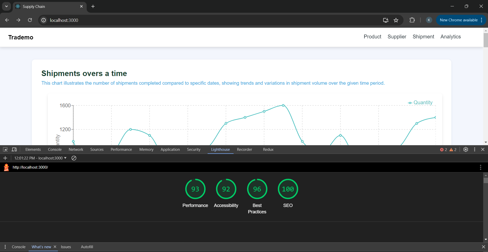

# global-supply-chain

# Live Link - https://global-supply-chain-p8ps.vercel.app/

    - Application is deployed on vercel.

# Github Repository: https://github.com/krushang04/global-supply-chain

# Framework and Plugins:

    - This application is built using the ReactJS framework.

    - Incorporates various libraries such as recharts, react-table, react-router-dom, axios and more.

# Page Load Time:

    - 

    - Performance: 93
    
    - Accessibility: 92

    - Best Practices: 96

    - SEO: 100

# Performance Optimisations

    1. Lazy Loading: By utilizing React.lazy for importing components, I ensured that components are loaded only when they are needed. This prevents the entire application from being bundled and loaded all at once, reducing the initial load time. Components such as AnalyticsChart, ProductTable, SupplierTable, ShipmentTable, and NotFound are now loaded on-demand, which helps in managing the application's resource usage more efficiently.

    2. Code Splitting: This technique is achieved through dynamic imports with React.lazy. By splitting the code into smaller chunks, each chunk is loaded only when required. This approach significantly decreases the initial bundle size, leading to faster load times and improved performance.

# Challenges and Solutions:

    - Pagination of Table: I encountered a challenge with implementing pagination for tables. However, I resolved this issue by leveraging the built-in pagination functionality provided by react-table. This allowed me to efficiently manage large datasets and provide a smooth user experience.

    - Integrating Data from Multiple Sources for Chart Visualization: Another challenge was creating charts by mapping data from two separate files. To address this, I utilized Recharts, which proved to be very effective for plotting graphs. I first thoroughly understood the dataset, then mapped the product IDs to retrieve corresponding product names from the product data. Next, I integrated this information with the shipment data to accurately display the relevant charts.

# Feature Implemented:

    - Generate tables for supplier data, product data, and shipment data.

    - Implemented pagination functionality in tables to enhance user experience.

    - Implemented a filter feature that allows users to sort data in ascending or descending order by clicking on column headers.

    - Users can perform a global search of the data using a search bar.

    - Implemented a line chart to display shipments over time (by date).

    - Created multiple bar graphs to enhance user experience. Navigate to the `/analytics` or `/` page to view all the charts.

    - Configuring the routing for better user experience.

    - Taken care of performance as well. 
